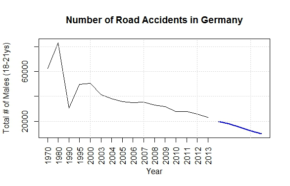

<style>
.footer {
    color: black;
    background: #E8E8E8;
    position: fixed;
    top: 10%;
    text-align:center;
    width:100%;
}
</style>


<style>
.small-code pre code {
  font-size: 1.2em;
}
</style>


Forecasting road accident responsibles (gender/age) in Germany
========================================================
author: Bernhard Thoni
date: 15.03.2015
font-import: http://fonts.googleapis.com/css?family=Courgette
font-family: 'Courgette'
transition: rotate
transition-speed: slow


Introduction, Dataset and Model
========================================================

<p><br><div class="footer">  
- The data are official numbers from Germany's _*ADAC*_ 
   (automobile club)
- Beginning with 2003, the data are complete <small>(yearwise)</small> till 2013
   (before this date, some years are missing)
- [Here](https://selfman2.shinyapps.io/accident-report) you can find the shiny-app developed for the course project:
- I use the R forecast library for this project
- The applied methodology is: arima
</div>


Model of the Forecast
========================================================
id: modelslide
class: small-code


```r
library(xlsx)
my_cc<-c("character",rep("integer", 19))
my_data <- read.xlsx("data/adac-unfallgeschehen.xlsx", "Page 13", startRow = 2, header = T, colIndex=c(1,2,3,4,5,6,7), colClasses = my_cc)
#my_data$Year<-as.Date(my_data$Year,origin=0)
my_data$Year<-as.character(my_data$Year)
  
library(forecast)
mfit<-auto.arima(my_data$F.less18)
fcast<-forecast(mfit, h=5)
```


Slide With Plot
========================================================
incremental: true
class: small-code


```r
plot(fcast, main = "Number of Road Accidents in Germany", ylab = "Total # of Males", xlab = "Year", xaxt="n", plot.conf="FALSE")
my_years<-as.integer(my_data$Year)
axis(1,at=1:16,label=my_years,las=2)
grid()
```


[(see slide with model)](#/modelslide)


Conclusion
========================================================

<div class="footer">
Although forecasting too far into the future is dangerous, -as it could result in numbers below zero-, this application at least is able to demonstrate the tendency of the general development (5ys into the future from 2013 onwards).
Thus it could be helpful for policy-makers for differentiating between various age/gender constellations when elaborating new traffic security measures. 
</div>

